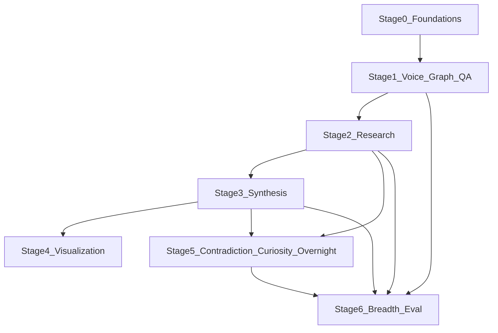

# Axion — Master Development Plan

This document expands [plan.md](plan.md) into a **full multi-stage engineering roadmap**: what to build, in what order, with extension points and risks. It is the canonical **delivery** companion to the product vision in `plan.md`.

**Repo status:** Stages **0–4** are implemented in-tree (see [README.md](README.md), `apps/api`, `apps/python-worker`, `packages/contracts`). Stages **5+** remain roadmap; checklists in §17 reflect completed vs pending work.

---

## 1. North star

**Axion** integrates **external information** (research) with **internal experience** (voice, notes, disagreements, what mattered) and persists them in a **temporal, provenance-rich memory** so the system can answer not only “what does the literature say?” but “**what do I believe**, with what confidence, and **how has that changed**?”

Success is measured by:

- Faithful, cited answers (low hallucination storage and retrieval).
- Beliefs and graph edges that **accumulate history** rather than silently overwriting.
- User trust: human-in-the-loop where automation would replace judgment.

---

## 2. Locked decisions

Stakeholder choices that constrain implementation:

- **Stack — polyglot**: **Python** for transcription, embeddings, research/synthesis workers, and CPU-heavy parsing; **TypeScript on Node** for the primary HTTP API and (from Stage 4 onward) the web UI. Define **contracts** early: OpenAPI or JSON Schemas for public APIs; internal job payloads versioned; trace IDs propagated across processes.
- **Deployment — local, single-user (v1)**: Primary store **SQLite** (relational graph, documents, episodic log); audio and large blobs on the **local filesystem** under a configurable data directory; **API key** (optional) for local access only. Moving to Postgres and object storage is a documented step when requirements exceed one machine (sync, backup service, or SaaS).
- **Models — local-first**: Default to **on-device transcription** (e.g. faster-whisper) and **local LLM** where feasible (e.g. Ollama); **cloud providers remain pluggable** behind interfaces for users who opt in or for tasks that exceed local hardware.
- **TS ↔ Python — HTTP**: Python exposes a small **local HTTP worker** (e.g. FastAPI) for transcription and extraction; the Node API calls it on localhost; document ports and startup order in README.
- **Monorepo — Turborepo + pnpm**: TypeScript and shared artifacts live in **pnpm workspaces**; **Turborepo** orchestrates `lint`, `test`, `typecheck`, `build`, and `dev` across packages. Python uses `pyproject.toml` under `apps/python-worker` with a **local `.venv`** created by `scripts/ensure-venv.sh` (invoked from that app’s `package.json` scripts); **not** installed by pnpm. CI runs `pnpm turbo run …` with **`--concurrency=1`** so parallel tasks do not race venv/pip. Optional: `uv` / manual `pip install -e ".[dev]"` (see worker README).
- **Observer / executor split — narrow writes**: autonomous execution is modeled as an **executor loop** plus an **observer loop**. The executor plans, decomposes, uses tools, and stores provisional artifacts. The observer inspects traces and outputs **typed, evidence-linked candidate records** (`observer_note`, `candidate_task`, `candidate_belief`, `uncertainty_flag`, `contradiction_flag`, `coverage_gap`, `novelty_signal`). In v1 the observer does **not** directly mutate canonical beliefs or graph validity; approvals flow through a **promotion gate**, and synthesis remains the canonical owner of belief history.

---

## 3. Layered architecture (reference)

| Layer | Responsibility | Consumes | Produces |
|--------|----------------|----------|----------|
| **Experience** | Capture subjective, contextual inputs | Audio, text, imports | Normalized experiences, transcripts, emotion/stance signals |
| **Research** | Autonomous and batched world-knowledge gathering | Topics, open questions, schedules | Claims, facts, summaries, sources, confidence |
| **Observer** | Inspect runs, traces, and tool outputs for uncertainty, contradictions, and next actions | Execution runs, episodic log, tool outputs, replay artifacts | Typed observations, candidate beliefs/tasks, promotion inputs |
| **Memory** | Durable hybrid store | Experience + research artifacts | Documents, graph nodes/edges, episodic log, vectors |
| **Synthesis** | Turn raw into **beliefs** and **open questions** | Memory slices | Belief nodes (append-only history), contradictions to resolve |
| **Retrieval** | Conversational Q&A and analytics queries | Memory + synthesis | Structured answers: evidence, beliefs, contradictions, evolution |
| **Visualization** | Human exploration | Same APIs as retrieval | Graph, timeline, research replay, curiosity map |
| **Evaluation** | Regression and quality | Golden sets + traces | Metrics over time; gates for risky features |

Stages below map to these layers incrementally so each phase ships **usable software** without blocking future depth.

---

## 4. Guiding principles

1. **Provenance first**: every automated extraction or summary is tied to source document IDs, (when possible) spans, model ID, and prompt/version.
2. **Append-only beliefs**: “I used to believe X” remains queryable; synthesis **supersedes** with new rows or validity intervals, it does not destroy history.
3. **Repository boundaries**: graph store, vector store, and LLM/transcription providers sit behind interfaces so SQLite → Postgres, or flat graph → Neo4j, does not rewrite business logic.
4. **Single-user clarity until explicit multi-tenant**: default to one user “tenant”; schema keys `user_id` or `workspace_id` where migration pain would otherwise be high.
5. **Defer clever automation** until **evaluation** exists for the pathways that write to memory (ingestion, synthesis).
6. **Observer reads everywhere, writes narrowly**: the observer may inspect broad system activity, but it only emits candidate records with provenance and confidence; promotion and synthesis decide what becomes durable belief or task state.

---

## 5. Stage 0 — Foundations (short, can merge with Stage 1)

**Goal**: Repo, configuration, observability, and deployment shape that every later stage assumes.

**Deliverables**

- **Turborepo monorepo** layout (document in README): **`apps/api`** (TypeScript HTTP API), **`apps/python-worker`** (FastAPI + `pyproject.toml`), **`packages/contracts`** (JSON Schema / OpenAPI fragments for public API and internal job payloads). Root: `package.json`, `pnpm-workspace.yaml`, `turbo.json`. Future UI (Stage 4+) typically **`apps/web`** alongside these.
- Environment-based config (secrets, API base URLs); per-app or root `.env.example`.
- Structured logging + request tracing IDs.
- CI: `pnpm turbo run lint test typecheck build` with **`--concurrency=1`** for reliable Python setup; GitHub Actions in [`.github/workflows/ci.yml`](.github/workflows/ci.yml); cache pnpm + Turbo; optional container image for `apps/api` (not required yet).
- Minimum security: auth story (API key for single user, or OAuth later), rate limits, file upload size caps.

**Exit criteria**: `health` + `ready` endpoints; documented local run; no production secrets in repo.

---

## 6. Stage 1 — Experience (voice) + minimal graph + Q&A

**Goal** ([plan.md](plan.md) Phase 1): prove the **Experience → Memory → Retrieval** loop with one high-signal channel.

**Implementation split (polyglot)**

- **TypeScript API** (`apps/api`): **Fastify** HTTP API — multipart upload, CRUD for experiences/documents, **`POST /qa`** Q&A, SQLite via **better-sqlite3 + Drizzle ORM** with migrations in `apps/api/drizzle/`.
- **Python worker** (`apps/python-worker`): **local HTTP service** (FastAPI) for transcription + structured extraction; Node API is the sole public entrypoint and delegates heavy work to Python. Schemas consumed by both sides live in **`packages/contracts`**.

**Scope**

- Voice note ingestion: upload → transcribe → store transcript as a document.
- LLM **entity / relation / emotion / uncertainty** extraction (structured JSON) with **provenance** back to the transcript.
- Relational **graph** (nodes + edges) with `valid_from` / `valid_to`-ready fields and confidence nullable on machine-generated edges.
- **Episodic log**: ingestion and extraction events with JSON payloads.
- **Q&A API**: retrieve relevant transcripts and optional 1-hop graph context; answers must **cite** document IDs; expose aggregate confidence and “what wasn’t found.”

**Out of scope**

- Overnight research loop, belief table separate from raw graph, full vector platform (retrieval today: **keyword / stopword-aware token match** over transcript bodies + optional 1-hop graph; FTS/BM25/embeddings are future upgrades).

**Data model (minimum)**

- `experience_records`, `documents`, `graph_nodes`, `graph_edges`, `episodic_events`.
- Enums for `node_kind` / `edge_predicate` kept **extensible** (add `claim`, `belief`, `study` later without breaking migrations).

**Exit criteria**: End-to-end demo: record → transcript in DB → graph populated → “What did I say about X?” with citations.

---

## 7. Stage 2 — Research layer + structured ingestion

**Goal**: **Objective knowledge** enters the same memory substrate as experience, with equal rigor on provenance.

**Scope**

- **Task model**: research goals (from user or from open questions), schedules (manual trigger first; cron/queue later).
- **Agent workflow** (incremental): plan → decompose into sub-questions → parallel tool calls (web search, fetch URL, optional PDF parse) → consolidate.
- **Dual-loop runtime**: research runs are modeled as an **executor loop** plus an **observer loop**. The executor owns goal selection, decomposition, tool use, raw artifact storage, and provisional completion. The observer reviews step traces and completed runs and emits typed observations rather than mutating canonical beliefs directly.
- **Artifacts**: per step store raw excerpts + normalized **claims** as graph nodes or typed documents; link to URLs and retrieval timestamps.
- **Ingestion breadth** (prioritize in order): web pages and snippets; optional PDF pipeline; optional “paste paper abstract” manual path.
- **Deduplication**: coarse dedup keys (URL, content hash) to avoid graph explosion.
- **Observation outputs**: persist `execution_runs`, `execution_steps`, `observer_notes`, and `promotion_reviews` so research runs are replayable and promotion decisions are inspectable.

**Integration**

- Episodic log: `research_run_started`, `sub_question_resolved`, `claim_committed`, plus run/step envelopes (`run_id`, `step_id`, `parent_step_id`, `artifact_refs`, `observer_verdict`, `promotion_status`) for replay and auditing.
- **Promotion gate**: observer outputs that may become durable tasks or beliefs flow through an approval layer (`POST /promotion/:id/approve` or equivalent), not directly into canonical belief storage.
- Retrieval: Q&A must blend **experience-backed** and **research-backed** evidence with clear labeling in the response schema.

**Exit criteria**: User can kick off a research task on topic T; system persists claims with sources; Q&A can answer “What does the literature say about T?” vs “What have I said about T?” using the same API shape.

---

## 8. Stage 3 — Synthesis layer (beliefs, open questions, evolution)

**Goal**: Move from “extracted graph” to **explicit beliefs** and **uncertainty** suitable for longitudinal queries.

**Scope**

- **Belief records**: append-only; fields include statement, confidence, evidence graph node IDs, `supersedes_belief_id` optional, timestamps.
- **Open questions**: linked to topics/entities; status (`open`, `researching`, `resolved`); link to research tasks.
- **Synthesis jobs**: periodic or on-demand merge of research + experience slices into candidate beliefs; **human confirmation** optional but recommended for high-impact beliefs (toggle). Synthesis remains the canonical owner of belief evolution even when observer-generated candidates exist upstream.
- **Stance aggregation**: map experience signals (“feels overhyped”) into belief-level hypotheses with lower confidence than explicit user assertions.

**Retrieval**

- Standard question types: “What do I believe about X?”, “What am I uncertain about regarding X?”, “What evidence supports belief B?”

**Exit criteria**: Belief timeline query returns ordered belief versions for a topic; open questions drive research task suggestions (manual link is enough).

---

## 9. Stage 4 — Visualization

**Goal**: Make memory **inspectable** without only chatting.

**Scope**

- **Graph explorer**: subgraph API (by topic, time window, confidence threshold); UI with node types (experience vs research vs belief), edge strength, recency cues.
- **Timeline view**: belief evolution + major ingestions/research runs.
- **Research replay**: step-through of a research run from episodic + intermediate artifacts (read-only narrative).

**Technical**

- Likely **`apps/web`** (or equivalent) consuming the same APIs; auth aligned with Stage 0.

**Exit criteria**: A user can visually trace why a belief exists and which experiences and sources contributed.

---

## 10. Stage 5 — Contradiction engine, curiosity engine, overnight mode

**Goal**: Active **maintenance** of understanding: surface conflicts, suggest exploration, run autonomous batches safely.

**Contradiction engine**

- Detect: conflicting claims (same subject/predicate polarity), belief vs new high-confidence research, stale edges past TTL policies.
- UX/API: list `contradiction_candidates` with evidence pointers; user resolution flows update graph validity or spawn new beliefs (never silent delete).

**Curiosity engine**

- Signals: recurring entities, repeated confusion phrases, unanswered follow-ups in conversations (when that channel exists), dormant open questions.
- Outputs: ranked suggested research tasks or reflection prompts.

**Overnight research mode**

- Scheduler + guardrails: max cost, max runtime, allowlist domains, replay from episodic log.
- Observer loop required on unattended runs: overnight execution may store provisional artifacts automatically, but observer outputs remain candidate records until they pass the promotion/evaluation gate.
- **Evaluation gate**: no unattended write path that bypasses proven accuracy thresholds once golden sets exist.

**Exit criteria**: Contradictions and curiosity suggestions are explainable; overnight runs are budget-bounded and observable.

---

## 11. Stage 6 — Experience breadth + social + evaluation hardening

**Goal**: Fulfill the **full experience surface** from [plan.md](plan.md) and make quality **measurable**.

**Experience channels**

- Conversations (AI + manual human logs): disagreements, questions, follow-ups.
- Highlights and annotations (books, PDFs, articles) with “this mattered” weighting.
- Social / trusted-source weighting (person nodes, credibility on edges).
- Daily reflection prompts and structured capture.

**Evaluation**

- Golden dataset (50–100 Q&A pairs) covering faithfulness, relevance, context precision/recall ([plan.md](plan.md)).
- Automated eval runs on PR or nightly; track regressions.

**Exit criteria**: Multi-channel ingestion normalized to the same graph + belief model; eval dashboards or reports exist.

---

## 12. Long-term vision (post–Stage 6)

- Voice-first UX; optional on-device transcription and local models for privacy tiers.
- Real-time augmentation (ambient capture with explicit consent model).
- Speculative: deeper biometric or BCI-adjacent inputs — **only** with ethics review and legal clarity; treat as research track, not core product dependency.

---

## 13. Cross-cutting concerns (all stages)

| Concern | Minimum approach |
|---------|------------------|
| **Privacy** | Encrypt data at rest when not single-machine; clarify retention for audio originals. |
| **Cost** | Per-feature budget caps; token accounting in episodic log. |
| **Migration** | **Drizzle** SQL migrations under `apps/api/drizzle/` (Alembic-equivalent discipline); versioned JSON in episodic payloads. |
| **Observability** | Correlate ingestion → extraction → synthesis runs with a single `trace_id`; execution/observer flows add `run_id`, `step_id`, and artifact references for replay. |
| **Abuse / safety** | Upload malware scanning; prompt injection defenses on untrusted web content in Stage 2+. |

---

## 14. Dependency overview

---

## 15. Risk register (from [plan.md](plan.md), made concrete)

| Risk | Mitigation in design |
|------|----------------------|
| Complexity overload | Strict stage gates; one channel until Stage 6 breadth. |
| Hallucinations in memory | Provenance, citations, confidence defaults, eval gates before autonomous writes scale. |
| Stale knowledge | Temporal validity on edges; contradiction engine; scheduled refresh tasks. |
| Over-automation | Human confirmation for belief promotion; reflection prompts in experience layer. |

---

## 16. Document maintenance

- **Product why**: update [plan.md](plan.md).
- **Delivery how / when**: update this file when scope or ordering changes.
- Large architectural decisions (ADR) can live in `docs/adr/` once the repo grows.

---

## 17. Master checklist

Use `- [ ]` / `- [x]` in your editor to track progress. Wording mirrors sections 5–11 and 13.

### Stage 0 — Foundations

- [x] Turborepo + pnpm: `apps/api`, `apps/python-worker`, `packages/contracts`; root `turbo.json` + workspace config
- [x] Environment-based config and `.env.example` (no secrets in repo)
- [x] Structured logging + request `trace_id` across Node ↔ Python calls (`x-trace-id`; **pino** on API)
- [x] CI: `pnpm turbo run lint test typecheck build --concurrency=1` (Python via `apps/python-worker` + `ensure-venv.sh`)
- [x] `GET /health` and `GET /ready` (DB ping + worker `/health`)
- [x] Local run documented (startup order: Python worker, then API; root [README.md](README.md))
- [x] API key (optional; skips `/health` & `/ready`) + upload size limits + basic rate limit

### Stage 1 — Voice, graph, Q&A

- [x] Multipart voice upload → filesystem blob + `experience_records` row (`POST /experiences/voice`)
- [x] Python worker: transcribe (**faster-whisper** optional extra; **`AXION_TRANSCRIBE_STUB=1`** for CI/dev without model)
- [x] `documents` row for transcript + link to experience (`kind: transcript`)
- [x] Python worker: structured extraction (Ollama when available; **deterministic stub** fallback) → graph + episodic payload
- [x] `graph_nodes` / `graph_edges` with confidence + temporal fields; episodic events for ingest/transcribe/extract
- [x] **`POST /qa`**: keyword retrieval + optional 1-hop graph; **citations**, confidence, gaps in JSON response
- [x] End-to-end demo: [`scripts/demo.sh`](scripts/demo.sh) + API integration test (mocked worker `fetch`)

### Stage 2 — Research

- [x] Research task model + manual trigger
- [x] Agent loop: plan → sub-questions → tools (search, fetch, optional PDF)
- [x] Persist `execution_runs` + `execution_steps` for replayable research execution
- [x] Observer loop emits typed notes (`observer_note`, `candidate_task`, `candidate_belief`, `uncertainty_flag`, `contradiction_flag`, `coverage_gap`, `novelty_signal`)
- [x] Promotion gate stores approvals/rejections separately from canonical belief state
- [x] APIs: `POST /research/runs`, `GET /runs/:id/replay`, `GET /runs/:id/observations`, `POST /promotion/:id/approve`
- [x] Persist excerpts + claims with URLs, timestamps, dedup keys
- [x] Episodic: `research_run_*`, `claim_committed`, etc., with `run_id` / `step_id` / `artifact_refs` / `observer_verdict` / `promotion_status`
- [x] Q&A response schema labels **experience** vs **research** evidence

### Stage 3 — Synthesis

- [x] Append-only **belief** records (+ `supersedes` / validity)
- [x] Open questions: statuses + link to research tasks
- [x] Synthesis job (batch or on-demand) + optional human-confirm toggle; canonical sink for observer-approved belief candidates
- [x] Stance aggregation from experience signals → lower-confidence beliefs
- [x] APIs: belief timeline, uncertainty, evidence-for-belief

### Stage 4 — Visualization

- [x] Subgraph API (filters: topic, time, confidence)
- [x] Graph UI: node types, edges, recency/confidence cues
- [x] Timeline UI: beliefs + major ingest/research markers
- [x] Research replay UI (read-only narrative from episodic + artifacts)

### Stage 5 — Contradiction, curiosity, overnight

- [ ] Contradiction detection + `contradiction_candidates` API
- [ ] User resolution flow (validity updates, new beliefs; no silent deletes)
- [ ] Curiosity signals + ranked suggestions (research / reflection)
- [ ] Overnight scheduler: budgets, allowlists, observability
- [ ] Overnight runs use observer loop + promotion gate before any durable task/belief promotion
- [ ] Evaluation gate on unattended writes (when golden set exists)

### Stage 6 — Breadth + evaluation

- [ ] Conversation / manual log ingestion path
- [ ] Highlights & annotations pipeline + “mattered” weighting
- [ ] Social / trusted-person nodes + credibility on edges
- [ ] Daily reflection prompts + structured storage
- [ ] Golden dataset (50–100 Q&A)
- [ ] Automated eval (PR or nightly) + trend tracking

### Cross-cutting (ongoing)

- [ ] Provider interfaces: transcription, LLM (local + optional cloud) — *partially* implicit via env + worker; formal interfaces TBD
- [x] Migrations/versioning for DB — **Drizzle** migrations; episodic JSON payloads versioned ad hoc in payloads
- [ ] Privacy: retention policy for audio; optional encryption note for non–single-machine
- [ ] Cost/token accounting in episodic or metrics
- [ ] Stage 2+: prompt-injection / untrusted-web handling for research fetches

---

*Maintained for the Axion repository. Align execution backlog with this file; refresh §17 when stages ship or scope shifts.*
